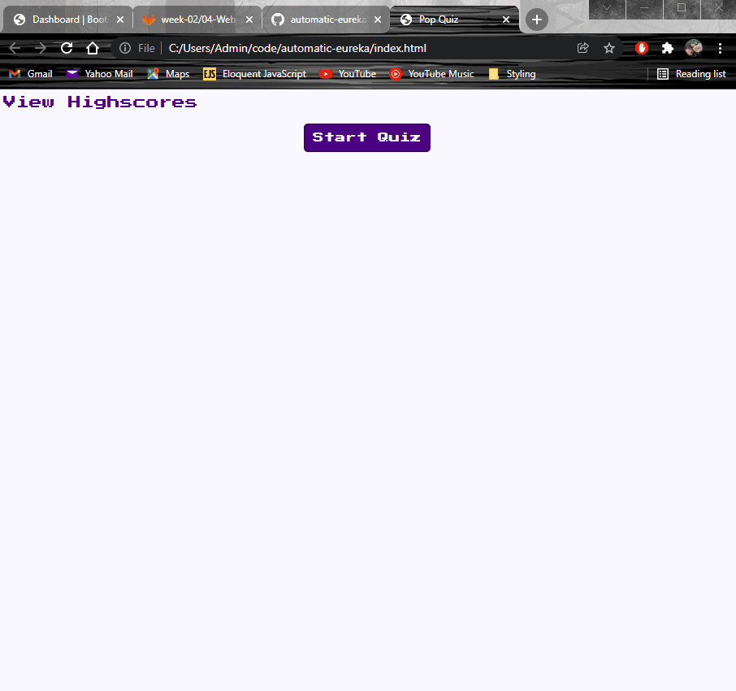

# automatic-eureka

## Description:
Creating a cat quiz to test my HTML, CSS, and Javascript skills.

## Overview:
I really struggled getting the button/anwsers to work correctly and struggled with getting the elements to hide/unhide and ended up going through a few different ways of going about it before I foudn one that worked.

## Screenshot:

### [GitHub](https://github.com/Acanthodoris/automatic-eureka)

### [GitHub Page](https://acanthodoris.github.io/automatic-eureka/)

# Credits:
* https://www.youtube.com/watch?v=riDzcEQbX6k
* https://www.w3schools.com/howto/howto_js_countdown.asp
* https://www.w3schools.com/jsref/met_win_clearinterval.asp
* https://www.w3schools.com/jsref/met_loc_reload.asp
